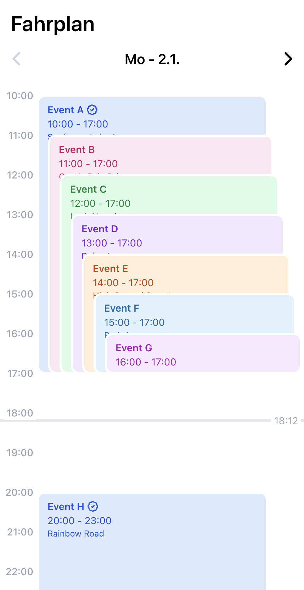

# Fahrplan

A quick and easy way to turn an iCAL calendar into an interactive web page for your event.

 

## Getting Started

Create an `.env` file which sets the following environment variables:

```bash
ICAL_URL="<url of ical file>"      # use http://localhost:<port>/<filename>.ics for a local file (public/)
NEXT_PUBLIC_BASE_PATH="<base path, e.g. /fahrplan or />"

# optional
DATE_RANGE_CLAMP_CURRENT_YEAR=true # option 1: only show events in the current year

DATE_RANGE_CLAMP_START=2023-01-02  # option 2: specify a starting and
DATE_RANGE_CLAMP_END=2023-03-04    # option 2: ending date
```

Then, run the development server:

```bash
npm run dev
# or
yarn dev
```

Open [http://localhost:3000](http://localhost:3000) with your browser to see the result.
